  Hi there, I'm <b>Duc Anh Tran.</b>

<b>Languages and Tools:</b>

  <code></code>
  <code></code>
  <code></code>
  <code></code>
  <code></code>
  <code></code>

<b>My Github Stats:</b>
 
 

  

<b>Playing...</b>

  <picture>
    <source style="min-width: 100%;" media="(prefers-color-scheme: dark)" srcset="https://raw.githubusercontent.com/15110011/15110011/output/github-snake-dark.svg">
    <source style="min-width: 100%;" media="(prefers-color-scheme: light)" srcset="https://raw.githubusercontent.com/15110011/15110011/output/github-snake.svg">
    
  </picture>

